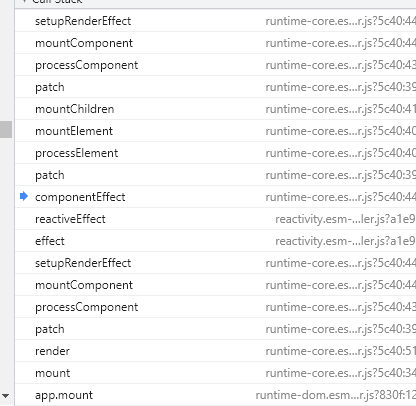

# Part Vue3
## compile

模板编译之后，App.vue文件转换为：（template都变为render函数）
```javascript
rootComponent = {
    components: {
        Watch: { // Watch是父组件的名字
            components: {
                Child: { // Child是子组件的名字
                    inject: ["provideObj"]
                    props: ["obj"]
                    render: ƒ render(_ctx, _cache, $props, $setup, $data, $options)
                    setup: ƒ setup(props, ctx)
                    __file: "src/case/Watch/Child.vue"
                    __hmrId: "7db4b096"
                }
            },
            provide: ƒ provide(),
            render: ƒ render(_ctx, _cache, $props, $setup, $data, $options),
            setup: ƒ setup(),
            __file: "src/case/Watch/Parent.vue",
            __hmrId: "47b388c0"
        }
    },
    data: data(),
    methods: {},
    render: ƒn render(_ctx, _cache, $props, $setup, $data, $options),
    __file: "src/App.vue",
    __hmrId: "7ba5bd90"
}

```

## 为什么Composition API可以获取到currentInstance

**compositionAPI.js**
```javascript
var Plugin = {
    install: function (Vue) { return install(Vue); },
};

if (typeof window !== 'undefined' && window.Vue) {
    window.Vue.use(Plugin);
}

export default Plugin;
```
因为：compositionAPI包含了一个plugin，在引用了vue.js和compositionAPI时，会执行window.Vue.use(Plugin)，将Vue注入到compositionAPI当中。

## createApp()

- 通过ensureRenderer，调用createRenderer，生成唯一一个renderer渲染器；
  - 使用ensureRenderer包装：单例模式，有renderer就返回，没有就createRenderer

**runtime-dom**
```javascript
// rendererOptions: 对dom操作的一些方法：remove、insert、parent等
function ensureRenderer() {
    return renderer || (renderer = createRenderer(rendererOptions));
}

const createApp = ((...args) => {
    const app = ensureRenderer().createApp(...args);
    if ((process.env.NODE_ENV !== 'production')) {
        injectNativeTagCheck(app);
    }
    const { mount } = app;
    app.mount = (containerOrSelector) => {
        const container = normalizeContainer(containerOrSelector);
        if (!container)
            return;
        const component = app._component;
        if (!isFunction(component) && !component.render && !component.template) {
            component.template = container.innerHTML;
        }
        // clear content before mounting
        container.innerHTML = '';
        const proxy = mount(container);
        container.removeAttribute('v-cloak');
        container.setAttribute('data-v-app', '');
        return proxy;
    };
    return app;
});
```

- createApp
  - createAppContext生成一个context上下文，保存着components、provides、directive等实例
  - 创建app，和context相互引用，同时app上还有use、provide、mixin、directive等方法；
    - 在调用app.component、provide之类的方法时，将组件、provide的值保存到context当中

**runtime-core**
```javascript
function createAppContext() {
    return {
        app: null,
        config: {
            isNativeTag: NO,
            performance: false,
            globalProperties: {},
            optionMergeStrategies: {},
            isCustomElement: NO,
            errorHandler: undefined,
            warnHandler: undefined
        },
        mixins: [],
        components: {},
        directives: {},
        provides: Object.create(null)
    };
}
function createAppAPI(render, hydrate) {
    return function createApp(rootComponent, rootProps = null) {
        const context = createAppContext();
        const installedPlugins = new Set();
        let isMounted = false;
        const app = (context.app = {
            _uid: uid++,
            _component: rootComponent,
            _props: rootProps,
            _container: null,
            _context: context,
            version,
            use(plugin, ...options) {
                if (plugin && isFunction(plugin.install)) {
                    installedPlugins.add(plugin);
                    plugin.install(app, ...options);
                }
                else if (isFunction(plugin)) {
                    installedPlugins.add(plugin);
                    plugin(app, ...options);
                }
                return app;
            },
            mixin(mixin) {
                if (__VUE_OPTIONS_API__) {
                    if (!context.mixins.includes(mixin)) {
                        context.mixins.push(mixin);
                    }
                }
                return app;
            },
            component(name, component) {
                context.components[name] = component;
                return app;
            },
            directive(name, directive) {
                context.directives[name] = directive;
                return app;
            },
            mount(rootContainer, isHydrate) {},
            unmount() {},
            provide(key, value) {
                context.provides[key] = value;
                return app;
            }
        });
        return app;
    };
}
```

## app.mount()：vue初次渲染


- mount挂载时，将rootComponent生成vnode，然后render渲染到container中
    - reder -> patch -> ... -> mountComponent:
    - 1. 创建组件的实例instance
    - 2. setupComponent：
      - 2.1. 执行setup函数，并将result绑定到instance上
      - 2.2. 编译compile组件的template为render函数
      - 2.3. 处理vue2 option api的属性和方法：data(), methods, lifecycle hooks等
    - 3. setupRenderEffect：为组件创建rendering的effect
      - 3.1. 执行beforeMount钩子函数
      - 3.2. 执行instance的render方法，获取subTree（子节点的vnode）
      - 3.3. 递归patch subTree
      - 3.4. 将m mounted的hook函数添加到postCb的队列当中，在render执行结束后执行队列的hook函数。

```javascript
const createApp = ((...args) => {
    const app = ensureRenderer().createApp(...args); // createApp是上面的createApp方法
    const { mount } = app;
    app.mount = (container) => {
        const component = app._component;
        if (!isFunction(component) && !component.render && !component.template) {
            component.template = container.innerHTML;
        }
        container.innerHTML = ''; // clear content before mounting
        const proxy = mount(container);
        container.removeAttribute('v-cloak');
        container.setAttribute('data-v-app', '');
        return proxy;
    };
    return app;
});
function createAppAPI(render, hydrate) {
    return function createApp(rootComponent, rootProps = null) {
        const context = createAppContext();
        const installedPlugins = new Set();
        let isMounted = false;
        const app = (context.app = {
            _uid: uid++,
            _component: rootComponent,
            _props: rootProps,
            _container: null,
            _context: context,
            version,
            use(plugin, ...options) {},
            mixin(mixin) {},
            component(name, component) {},
            directive(name, directive) {},
            mount(rootContainer, isHydrate) {
                if (!isMounted) {
                    const vnode = createVNode(rootComponent, rootProps);
                    vnode.appContext = context;
                    if ((process.env.NODE_ENV !== 'production')) {
                        context.reload = () => {
                            render(cloneVNode(vnode), rootContainer);
                        };
                    }
                    render(vnode, rootContainer);
                    
                    isMounted = true;
                    app._container = rootContainer;
                    rootContainer.__vue_app__ = app;
                    return vnode.component.proxy;
                }
            },
            unmount() {},
            provide(key, value) {}
        });
        return app;
    };
}

const render = (vnode, container) => {
    patch(container._vnode || null, vnode, container);
    flushPostFlushCbs();
    container._vnode = vnode;
};
const mountComponent = (initialVNode, container, anchor, parentComponent, parentSuspense, isSVG, optimized) => {
    const instance = (initialVNode.component = createComponentInstance(initialVNode, parentComponent, parentSuspense));
    setupComponent(instance);
    setupRenderEffect(instance, initialVNode, container, anchor, parentSuspense, isSVG, optimized);
};
function setupComponent(instance, isSSR = false) {
    isInSSRComponentSetup = isSSR;
    const { props, children, shapeFlag } = instance.vnode;
    const isStateful = shapeFlag & 4 /* STATEFUL_COMPONENT */;
    initProps(instance, props, isStateful, isSSR);
    initSlots(instance, children);
    const setupResult = isStateful
        ? setupStatefulComponent(instance, isSSR)
        : undefined;
    isInSSRComponentSetup = false;
    return setupResult;
}
function setupStatefulComponent(instance, isSSR) {
    const Component = instance.type;
    if ((process.env.NODE_ENV !== 'production')) {
        if (Component.name) {
            validateComponentName(Component.name, instance.appContext.config);
        }
        if (Component.components) {
            const names = Object.keys(Component.components);
            for (let i = 0; i < names.length; i++) {
                validateComponentName(names[i], instance.appContext.config);
            }
        }
        if (Component.directives) {
            const names = Object.keys(Component.directives);
            for (let i = 0; i < names.length; i++) {
                validateDirectiveName(names[i]);
            }
        }
    }
    // 0. create render proxy property access cache
    instance.accessCache = {};
    // 1. create public instance / render proxy
    // also mark it raw so it's never observed
    instance.proxy = new Proxy(instance.ctx, PublicInstanceProxyHandlers);
    if ((process.env.NODE_ENV !== 'production')) {
        exposePropsOnRenderContext(instance);
    }
    // 2. call setup()
    const { setup } = Component;
    if (setup) {
        const setupContext = (instance.setupContext =
            setup.length > 1 ? createSetupContext(instance) : null);
        currentInstance = instance;
        pauseTracking();
        const setupResult = callWithErrorHandling(setup, instance, 0 /* SETUP_FUNCTION */, [(process.env.NODE_ENV !== 'production') ? shallowReadonly(instance.props) : instance.props, setupContext]);
        resetTracking();
        currentInstance = null;
        
        handleSetupResult(instance, setupResult);
        
    }
    else {
        finishComponentSetup(instance);
    }
}
function handleSetupResult(instance, setupResult, isSSR) {
    if (isFunction(setupResult)) {
        // setup returned an inline render function
        instance.render = setupResult;
    }
    else if (isObject(setupResult)) {
        instance.setupState = proxyRefs(setupResult);
        if ((process.env.NODE_ENV !== 'production')) {
            exposeSetupStateOnRenderContext(instance);
        }
    }
    finishComponentSetup(instance);
}

function finishComponentSetup(instance, isSSR) {
    const Component = instance.type;
    // template / render function normalization
    if (!instance.render) {
        // could be set from setup()
        if (compile && Component.template && !Component.render) {
            if ((process.env.NODE_ENV !== 'production')) {
                startMeasure(instance, `compile`);
            }
            Component.render = compile(Component.template, {
                isCustomElement: instance.appContext.config.isCustomElement,
                delimiters: Component.delimiters
            });
            if ((process.env.NODE_ENV !== 'production')) {
                endMeasure(instance, `compile`);
            }
        }
        instance.render = (Component.render || NOOP);
        // for runtime-compiled render functions using `with` blocks, the render
        // proxy used needs a different `has` handler which is more performant and
        // also only allows a whitelist of globals to fallthrough.
        if (instance.render._rc) {
            instance.withProxy = new Proxy(instance.ctx, RuntimeCompiledPublicInstanceProxyHandlers);
        }
    }
    // support for 2.x options
    if (__VUE_OPTIONS_API__) {
        currentInstance = instance;
        applyOptions(instance, Component);
        currentInstance = null;
    }
}

const setupRenderEffect = (instance, initialVNode, container, anchor, parentSuspense, isSVG, optimized) => {
        // create reactive effect for rendering
        instance.update = effect(function componentEffect() {
            if (!instance.isMounted) {
                let vnodeHook;
                const { el, props } = initialVNode;
                const { bm, m, parent } = instance;
                // beforeMount hook
                if (bm) {
                    invokeArrayFns(bm);
                }
                const subTree = (instance.subTree = renderComponentRoot(instance));
               
                patch(null, subTree, container, anchor, instance, parentSuspense, isSVG);
                initialVNode.el = subTree.el;
                
                // mounted hook
                if (m) {
                    queuePostRenderEffect(m, parentSuspense);
                }
                instance.isMounted = true;
            }
            else {
                let { next, bu, u, parent, vnode } = instance;
                let originNext = next;
                let vnodeHook;
                if ((process.env.NODE_ENV !== 'production')) {
                    pushWarningContext(next || instance.vnode);
                }
                if (next) {
                    updateComponentPreRender(instance, next, optimized);
                }
                else {
                    next = vnode;
                }
                next.el = vnode.el;
                // beforeUpdate hook
                if (bu) {
                    invokeArrayFns(bu);
                }
                const nextTree = renderComponentRoot(instance);
               
                const prevTree = instance.subTree;
                instance.subTree = nextTree;
                // reset refs
                // only needed if previous patch had refs
                if (instance.refs !== EMPTY_OBJ) {
                    instance.refs = {};
                }
                
                patch(prevTree, nextTree, 
                // parent may have changed if it's in a teleport
                hostParentNode(prevTree.el), 
                // anchor may have changed if it's in a fragment
                getNextHostNode(prevTree), instance, parentSuspense, isSVG);
                if ((process.env.NODE_ENV !== 'production')) {
                    endMeasure(instance, `patch`);
                }
                next.el = nextTree.el;
                if (originNext === null) {
                    // self-triggered update. In case of HOC, update parent component
                    // vnode el. HOC is indicated by parent instance's subTree pointing
                    // to child component's vnode
                    updateHOCHostEl(instance, nextTree.el);
                }
                // updated hook
                if (u) {
                    queuePostRenderEffect(u, parentSuspense);
                }
            }
        }, (process.env.NODE_ENV !== 'production') ? createDevEffectOptions(instance) : prodEffectOptions);
    };
```

>2.1: setupResult-setup函数执行结果如果是对象，则会使用proxy进行代理，主要是将ref的值进行unWrap处理；
>    这样在template部分就不需要使用.value获取ref的值
 ```javascript
   function unref(ref) {
        return isRef(ref) ? ref.value : ref;
    }
    const shallowUnwrapHandlers = {
        get: (target, key, receiver) => unref(Reflect.get(target, key, receiver)),
        set: (target, key, value, receiver) => {
            const oldValue = target[key];
            if (isRef(oldValue) && !isRef(value)) {
                oldValue.value = value;
                return true;
            }
            else {
                return Reflect.set(target, key, value, receiver);
            }
        }
    };
    function proxyRefs(objectWithRefs) {
        return isReactive(objectWithRefs)
            ? objectWithRefs
            : new Proxy(objectWithRefs, shallowUnwrapHandlers);
    }
 ```

## keep-alive

## Suspense
**目前是实验阶段，后期可能会有出入**
Suspense组件用于处理在异步操作，在结果返回前展示fallback的内容；结果返回后展示default的内容；

如果default部分有多个async setup，他们会同步执行（示例是6s）

如果不用Suspense包裹，那么页面不展示任何内容

```html
<!-- 父组件 -->
<Suspense>
    <template #default>
        <User />
    </template>
    <template #fallback>Loading...</template>
</Suspense>

```
```javascript
// 子组件User
async setup() {
    let getUser = () => {
        return new Promise((res) => {
            setTimeout(() => {
                res();
            }, 3000);
        });
    };
    const state = await getUser();
    return { title: 123 }; // 不返回state也可以
}
// 孙组件Child
async setup() {
    let getUser = () => {
        return new Promise((res) => {
            setTimeout(() => {
                res();
            }, 3000);
        });
    };
    const state = await getUser();
    return { title: 123 }; // 不返回state也可以
}
```

Suspense组件挂载的时候：

suspense包含了default和fallback两个分支分别是pendingBranch和activeBranch；

1. 在mountSuspense的时候，会先去挂载pendingBranch（User），收集default组件下的async异步依赖
   1. 挂载pendingBranch即mountComponent，setupComponent会执行async setup
   2. 由于setup是async的，所以setupResult是一个promise对象，并赋给instance.asyncDep；并parentSuspense.registerDep注册依赖；将suspense的deps加1
   4. 如果suspense的deps大于0，则去挂载fallback组件
   5. 否则说明setup不是async，result不是promise，则立即执行suspense.resolve()
2. 

```javascript
const SuspenseImpl = {
    __isSuspense: true,
    process(n1, n2, container, anchor, parentComponent, parentSuspense, isSVG, optimized, rendererInternals) {
        if (n1 == null) {
            mountSuspense(n2, container, anchor, parentComponent, parentSuspense, isSVG, optimized, rendererInternals);
        }
        else {
            patchSuspense(n1, n2, container, anchor, parentComponent, isSVG, optimized, rendererInternals);
        }
    },
    hydrate: hydrateSuspense,
    create: createSuspenseBoundary
};
const mountComponent = (initialVNode, container, anchor, parentComponent, parentSuspense, isSVG, optimized) => {
    const instance = (initialVNode.component = createComponentInstance(initialVNode, parentComponent, parentSuspense));
    setupComponent(instance);
    
    // setup() is async. This component relies on async logic to be resolved
    // before proceeding
    if ( instance.asyncDep) {
        parentSuspense && parentSuspense.registerDep(instance, setupRenderEffect);
        // Give it a placeholder if this is not hydration
        // TODO handle self-defined fallback
        if (!initialVNode.el) {
            const placeholder = (instance.subTree = createVNode(Comment));
            processCommentNode(null, placeholder, container, anchor);
        }
        return;
    }
    setupRenderEffect(instance, initialVNode, container, anchor, parentSuspense, isSVG, optimized);
};
function setupStatefulComponent(instance, isSSR) {
    const Component = instance.type;
    // 0. create render proxy property access cache
    instance.accessCache = {};
    // 1. create public instance / render proxy
    // also mark it raw so it's never observed
    instance.proxy = new Proxy(instance.ctx, PublicInstanceProxyHandlers);
    // 2. call setup()
    const { setup } = Component;
    if (setup) {
        const setupContext = (instance.setupContext =
            setup.length > 1 ? createSetupContext(instance) : null);
        currentInstance = instance;
        const setupResult = callWithErrorHandling(setup, instance, 0 /* SETUP_FUNCTION */, [(process.env.NODE_ENV !== 'production') ? shallowReadonly(instance.props) : instance.props, setupContext]);
        currentInstance = null;
        if (isPromise(setupResult)) {
            instance.asyncDep = setupResult;
        }
    }
}
registerDep(instance, setupRenderEffect) {
    const hydratedEl = instance.vnode.el;
    suspense.deps++;
    instance
        .asyncDep.catch(err => {
            handleError(err, instance, 0 /* SETUP_FUNCTION */);
        })
        .then(asyncSetupResult => {
            suspense.deps--;
            // retry from this component
            instance.asyncResolved = true;
            const { vnode } = instance;
            handleSetupResult(instance, asyncSetupResult);
            if (hydratedEl) {
                // vnode may have been replaced if an update happened before the
                // async dep is resolved.
                vnode.el = hydratedEl;
            }
            const placeholder = !hydratedEl && instance.subTree.el;
            // 设置组件的effect，挂载对应组件
            setupRenderEffect(instance, vnode, 
            // component may have been moved before resolve.
            // if this is not a hydration, instance.subTree will be the comment
            // placeholder.
            parentNode(hydratedEl || instance.subTree.el), hydratedEl ? null : next(instance.subTree), suspense,isSVG, optimized);
            if (placeholder) {
                remove(placeholder);
            }
            updateHOCHostEl(instance, vnode.el);
            if ((process.env.NODE_ENV !== 'production')) {
                popWarningContext();
            }
            if (suspense.deps === 0) {
                suspense.resolve();
            }
        });
}
function mountSuspense(vnode, container, anchor, parentComponent, parentSuspense, isSVG, optimized, rendererInternals) {
    const { p: patch, o: { createElement } } = rendererInternals;
    const hiddenContainer = createElement('div');
    const suspense = (vnode.suspense = createSuspenseBoundary(vnode, parentSuspense, parentComponent, container, hiddenContainer, anchor, isSVG, optimized, rendererInternals));
    // start mounting the content subtree in an off-dom container
    patch(null, (suspense.pendingBranch = vnode.ssContent), hiddenContainer, null, parentComponent, suspense, isSVG, optimized);
    // now check if we have encountered any async deps
    if (suspense.deps > 0) {
        // has async
        // mount the fallback tree
        patch(null, vnode.ssFallback, container, anchor, parentComponent, null, // fallback tree will not have suspense context
        isSVG, optimized);
        setActiveBranch(suspense, vnode.ssFallback);
    }
    else {
        // Suspense has no async deps. Just resolve.
        suspense.resolve();
    }
}
```

## LifeCycle Hook

>在lifecycle hooks中增加了renderTracked和renderTriggered的钩子函数（rtc，rtg）

onMounted，onUpdated等hooks函数执行时，会将其参数（方法或方法数组）绑定到instance对应的属性上m和u等。
并且对hook进行wrap包装

```javascript

const createHook = (lifecycle) => (hook, target = currentInstance) => 
!isInSSRComponentSetup && injectHook(lifecycle, hook, target);

const onBeforeMount = createHook("bm" /* BEFORE_MOUNT */);

function injectHook(type, hook, target = currentInstance, prepend = false) {
    if (target) {
        const hooks = target[type] || (target[type] = []);
        const wrappedHook = hook.__weh ||
            (hook.__weh = (...args) => {
                if (target.isUnmounted) {
                    return;
                }
                // 在效果中禁用所有生命周期钩子的跟踪。 disable tracking inside all lifecycle hooks inside effects.
                pauseTracking();
                // Set currentInstance during hook invocation.
                // This assumes the hook does not synchronously trigger other hooks, which
                // can only be false when the user does something really funky.
                setCurrentInstance(target);
                const res = callWithAsyncErrorHandling(hook, target, type, args);
                setCurrentInstance(null);
                resetTracking();
                return res;
            });
        if (prepend) {
            hooks.unshift(wrappedHook);
        }
        else {
            hooks.push(wrappedHook);
        }
        return wrappedHook;
    }
}
function callWithAsyncErrorHandling(fn, instance, type, args) {
    if (isFunction(fn)) {
        const res = callWithErrorHandling(fn, instance, type, args); // 调用fn执行传入args
        if (res && isPromise(res)) {
            res.catch(err => {
                handleError(err, instance, type);
            });
        }
        return res;
    }
    const values = [];
    for (let i = 0; i < fn.length; i++) {
        values.push(callWithAsyncErrorHandling(fn[i], instance, type, args));
    }
    return values;
}
```

在development环境下，会将renderTracked和renderTriggered的hook函数作为render effect的option传入，并且rtc和rtg接收参数：
effect,target,key,type等；只在开发环境下有，生产环境没有这两个hook函数
执行时机：
    - renderTracked：在effect track()方法执行时执行rtc函数
    - renderTriggered：在effect trigger()方法执行时执行rtg函数
  
```javascript
activeEffect.options.onTrack({
    effect: activeEffect,
    target,
    type,
    key
});
effect.options.onTrigger({
    effect,
    target,
    key,
    type,
    newValue,
    oldValue,
    oldTarget
});
```


## vue如何处理update hook中的死循环问题
在执行updated的hook时，会将队列postCb中的函数依次执行。

在每次更新的时候，都会去创建一个seen（new Map），将hook的fn作为key，并记录其执行的次数；

如果次数大于100，就会报错。

## provide & inject

应用：`vuex`和`组件传值`

## SetupContext
context当中有一个expose，可以传入对象或函数供父级使用

expose将传入的内容exposed挂载到instance上
```
setup(props, { attrs, slots, emit, expose }) {
    const observed = reactive({
        a: 1
    })
    function setObservedA(value) {
        observed.a = value
    }
    expose({
        setObservedA
    })
    return {
        observed,
    }
}
```
```
// comp-b.vue
{
  template: `
    <comp-a ref="compa" />
  `,
  setup() {
    const compa = ref(null)
    onMounted(() => {
      // comp-a 调用 expose 之后, 父组件 ref 拿到的结果为调用 expose 时的参数。而不再是组件实例了
      compa.value.setObservedA(2)
    })
    return {
      compa
    }
  }
}
```
```javascript
export function createSetupContext(instance) {
  const expose = exposed => {
    instance.exposed = proxyRefs(exposed)
  }

  if (__DEV__) {
    return Object.freeze({
      get attrs() {
        return new Proxy(instance.attrs, attrHandlers)
      },
      get slots() {
        return shallowReadonly(instance.slots)
      },
      get emit() {
        return (event: string, ...args: any[]) => instance.emit(event, ...args)
      },
      expose
    })
  } else {
    return {
      attrs: instance.attrs,
      slots: instance.slots,
      emit: instance.emit,
      expose
    }
  }
}
```

## defineAsyncComponent 


